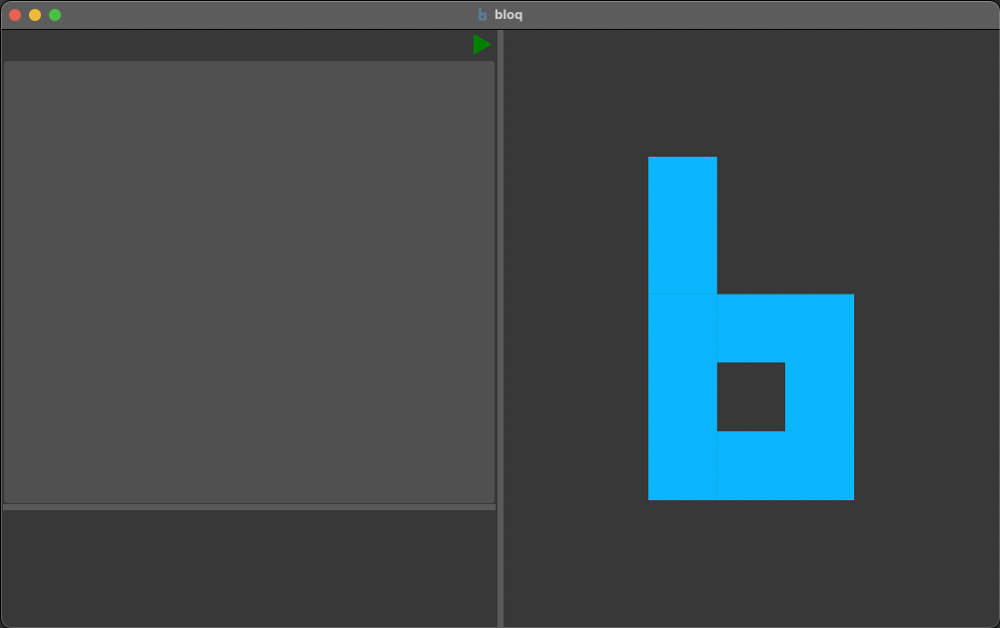
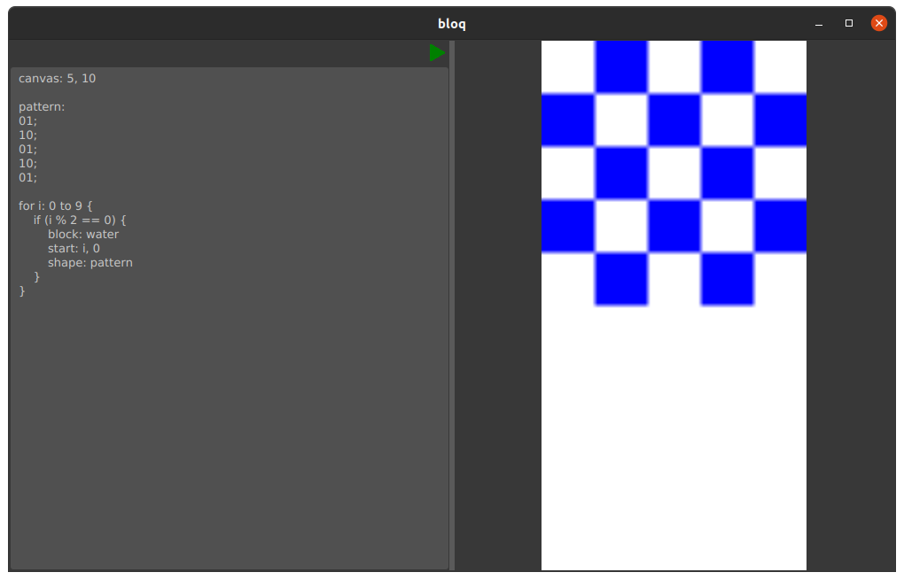

# **Bloq Grammar**

## **Introduction**
The Bloq grammar is a Antlr4 grammar that is designed to simplify the process of 2D map design for platformer/RPG/maze games. Bloq allows the user to create patterns of different blocks and place them on a canvas without having to learn how to use a game engine. 

---



## **Features**
- Variables
- Conditionals
- Functions
- Loops
- 2D bitmap 

---

## **Getting Started**

### Creating a Canvas:
Creating a canvas with height *h*, and width *w*:   

```
canvas: h, w
```

Defaults:  
h: 100   
w: 100
#
### Placing a Block:
Placing a block of *type* at the location (*x*, *y*) with shape *bitmap*:  

```
 block: type 
 start: x, y
 shape: bitmap
```

Defaults:  
```
start: 0, 0  
shape: 1;
```
*type* is a predefined type of block. 

Supported blocktypes:
```
land
water
lava
enemy
```

*bitmap* can be a variable that is previously assigned a bitmap, or it can be define on the next line after Shape.  
The bitmap should be in the monochrome format, setting a bit to 1 will place a block at that location.  
Every row (including the last) must be terminated with semicolon.  
The top left bit will be aligned to the start location.  
If a block is placed at a location that's already occupied, the new block will replace the old block.

Bitmap Structure:
```
slantedLine: 
0001;
0010;
0100;
1000;
```

Placing a slantedline water block at 0, 0 on a 4x4 canvas will look like the following:  


```
canvas: 4, 4

block: water
start: 0, 0
shape:
0001;
0010;
0100;
1000;
```

You can also place multiple block types in a single statement. 
The placement of each type of block can be defined in *shape*. 
The number associated with each block type corresponds to the position of that block type in the *block* statement, 
starting with 1.

```
canvas: 4, 4

block: water, lava, enemy
start: 0, 0
shape:
0001;
0020;
0300;
1000;
```
The code above will product the following image:


#
### Using Variables
Creating a integer variable named *name* with value *value*:

```
name: value
```

Creating a bitmap variable named *name*:

```
name:
row1;
row2;
...;
```
Currently Bloq only supports these two types of variable assignments.

#
### Using Loops
Repeating a statement *n* times:

```
for i: 1 to 10 {
    statement
}
```
Statement can be either a variable assignment, a block placement, or a function call.  
Nest for loops are currently unsupported.

#
### Using Conditionals
Executes a statement(s) if *condition* is true:
```
if (condition) {
    statement
}
```
Condition is a comparison between two mathematical expressions.  
Bloq currently only supports single condition if statements.  
Supported comparisons:  
| Comparison | Symbol |
| ---------- | ---------- |
| Equal | == |
| Not Equal | != |
| Greater | > |
| Less | < |
| Greater or Equal to | >= |
| Less or Equal to | <= |

Supported operations for mathematical expressions:
| Operation | Symbol |
| -------- | ------ |
| Addition | + |
| Subtraction | - |
| Multiplication | * |
| Division | / |
| Modulo | % |

#
### Using Functions
Creating a new function called *name* with parameters *a*, *b*:

```
define name(a, b) {
    statement
}
```

Calling the same function with arguments 1 and 2:

```
call name(1, 2)
```

---
## **Example**
```
canvas: 5, 10

pattern:
01;
10;
01;
10;
01;

for i: 0 to 9 {
    if (i % 2 == 0) {
        block: water
        Start: i, 0
        Shape: pattern
    }
}
```


---

#
### Features coming soon
Nested for loops  
Multiple conditions in if statement  
if/else statements  


## **Contributors**
Charlie Li, Janie Wang, Jessica Zhan, John Pham, and Shawn Lu.
